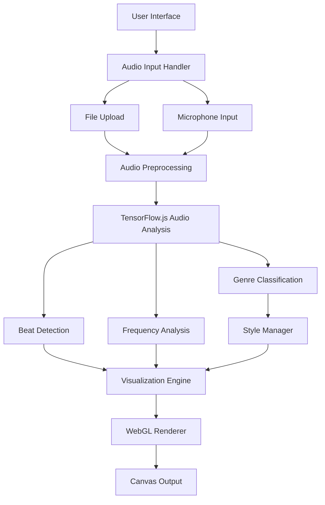
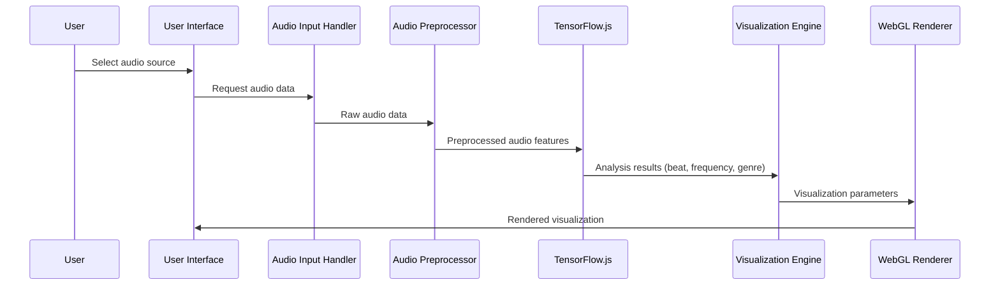

# AI Music Visualizer - Technical Architecture

## Overview
This document outlines the technical architecture for a web-based AI music visualizer that uses TensorFlow.js for audio analysis and WebGL for visualization. The application will analyze audio for beat detection and generate visual patterns that react to rhythm and frequency spectrum, with unique color schemes and animation styles for different music genres.

## Technology Stack
- **Frontend**: HTML5, CSS3, JavaScript (ES6+)
- **AI Analysis**: TensorFlow.js
- **Audio Processing**: Web Audio API
- **Visualization**: WebGL (via Three.js for easier implementation)
- **UI Framework**: None (vanilla JavaScript for lightweight implementation)
- **Build Tools**: None required (pure web technologies)

## System Architecture



## Core Components

### 1. Audio Input Handler
- Handles both file uploads and microphone input
- Uses Web Audio API for audio processing
- Converts audio to appropriate format for analysis

### 2. Audio Preprocessing Module
- Normalizes audio data
- Extracts relevant features for AI analysis
- Buffers audio for real-time processing

### 3. TensorFlow.js Audio Analysis
- Beat detection using pre-trained models
- Frequency spectrum analysis
- Music genre classification
- Real-time processing for live visualization

### 4. Visualization Engine
- WebGL-based rendering using Three.js
- Dynamic visual patterns that respond to audio features
- Configurable visualization parameters

### 5. Style Manager
- Maps music genres to color schemes
- Manages animation styles for different genres
- Handles transitions between different visual styles

### 6. User Interface
- Clean, stylized UI with dark theme
- Controls for audio input
- Visualization canvas
- Genre information display

## Implementation Approach

### Phase 1: Foundation
1. Set up basic HTML structure with canvas element
2. Implement audio input handling (file upload and microphone)
3. Create basic Web Audio API integration
4. Set up Three.js for WebGL rendering

### Phase 2: AI Integration
1. Integrate TensorFlow.js models for audio analysis
2. Implement beat detection functionality
3. Add frequency spectrum analysis
4. Develop genre classification feature

### Phase 3: Visualization
1. Create basic visualization that responds to audio features
2. Implement different visual patterns for various audio characteristics
3. Add color schemes and animation styles for different genres
4. Optimize performance for smooth real-time visualization

### Phase 4: UI/UX
1. Design and implement stylized user interface
2. Add responsive design for different screen sizes
3. Create intuitive controls for audio input
4. Add visual feedback for system status

## Data Flow



## Performance Considerations
- Use Web Workers for heavy audio processing to avoid blocking the main thread
- Implement efficient WebGL rendering techniques
- Optimize TensorFlow.js model inference for real-time performance
- Use requestAnimationFrame for smooth animations

## Browser Compatibility
- Modern browsers with Web Audio API support
- WebGL 2.0 support for advanced visualizations
- ES6+ JavaScript features
- MediaDevices API for microphone access

## File Structure
```
ai-music-visualizer/
├── index.html
├── css/
│   ├── styles.css
│   └── responsive.css
├── js/
│   ├── main.js
│   ├── audio-handler.js
│   ├── ai-analyzer.js
│   ├── visualizer.js
│   └── ui-manager.js
├── assets/
│   ├── models/ (TensorFlow.js models)
│   └── icons/
└── README.md
```

## Next Steps
1. Review this architecture with stakeholders
2. Begin implementation with Phase 1 tasks
3. Continuously test and optimize performance
4. Document code and user instructions